# OPD part2

## 微机的历史与体系结构

- 计算机历史
  - 第零代（1642-1945）- 机械计算机（механические компьютеры）
    - 税收累加器（Паскаль），手摇四则运算计算器（Лейбниц）
  - 第一代（1945-1955）- 电子管（электронные лампы）
    - COLOSSUS (1943, Тьюринг), ENIAC (1946, Моушли), IAS (1951, фон Нейман)
  - 第二代（1955-1965）- 晶体管（транзисторы）
    - ТХ-0 (1955, МТИ), PDP-1 (1961, DEC), PDP-8, 7090 (IBM), 6600 (1964, CDC)
  - 第三代（1965-1980）- 集成电路（интегральные схемы）
    - Cемейство System/360 (1965, IBM), PDP-11 (1970, DEC)
  - 第四代（1980-?）- 超大型集成电路（сверхбольшие интегральные схемы）
    - IBM PC (1981), Apple, Intel, IBM, Dec, Compaq, HP, Sun…
  - 第五代（1989-?）- 小型与隐型计算机（небольшие и «невидимые» компьютеры）
- 苏联/俄罗斯的计算机历史
  - 第一代（1945-1955）- 电子管（электронные лампы）
    - Лебедев, 1950, МЭСМ 
    - БЭСМ, 1953, БЭСМ — 10000 оп/с, 53КВТ.
  - 第二代（1955-1965）- 晶体管（транзисторы）
    - 5Э92б, 1964, самодиагностика, горячая замена, 500000 оп/c 
    - БЭСМ-6, 1965 год, +ковейерная обработка, удаленное управление по телеф. Линиями
  - 第三代（1965-1980）- 集成电路（интегральные схемы）
    - Директива «Ряд», 1968 год, клонирование S/360, 1971 год — ЕС ЭВМ 
    - Клоны РDP-11
  - 第四代（1980-?）- 超大型集成电路（сверхбольшие интегральные схемы）
    - Эльбрус — разработка по настоящее время
- 总线
  - 基本概念：计算寄部件之间的连接方式有以下两种
    - 分散连接：各部件之间使用单独的连线
      - 特点：较为复杂，无法解决I/O设备与主机之间连接的灵活性
    - 总线连接：将各部件连到一组公共信息传输线上
  - 定义：总线是连接多个部件的信息传输线，是各部件共享的传输介质
  - 特点：在某一时刻，只允许有一个部件向总线发送信息，而多个部件可以同时从总线上接收相同的信息
  - 结构：总线实际上是由许多传输线或通路组成，每条线可一位一位地传输二进制代码
  - 传输方式
    - 串行传输：在一条传输线上在一段时间内逐一传输一串二进制代码
    ```
    ----------------
    ```
    - 并行传输：在多条专属先上同时传输多串二进制代码
    ```
    ----------------
    ----------------
    ----------------
    ----------------
    ```
  - 总线分类
    - 按数据传送方式分类
      - 并行传输总线
        - 8 位传输总线
        - 16 位传输总线
        - 32 位传输总线
        - ......
      - 串行传输总线
    - 按总线适用范围分类
      - 计算机（包括外设）总线
      - 测控总线
      - 网络通信总线
      - ......
    - 按连接部件分类
      - 片内总线
        - 是指芯片内部的总线，例如 CPU 芯片内部，寄存器与寄存器之间、寄存器与算逻单元ALU之间都由片内总线连接
      - 系统总线（板级总线）
        - 指CPU、内存、I/O设备（通过I/O接口）各大部件之间的信息传输线，通常都安放在主板或各个插件板上
        - 按系统总线传输信息的不同，又可分为：
          - 数据总线：
            - 用来传输各功能部件之间的数据信息，它是双向传输总线，其位数与机器字长、存储字长有关，一般为8位、16位或32位
            - 数据总线的位数称为数据总线宽度，它是衡量系统性能的一个重要参数
            - 如果数据总线的宽度为8位，指令字长为16位，那么，CPU在取值阶段必须两次访问主存
          - 地址总线
            - 地址总线主要用来指出数据总线上的元数据或目的数据在主存单元的地址或I/O设备的地址,由CPU输出，单向传输
            - 地址线的位数与存储单元的个数有关，如地址线为20根，则对应的存储单元个数为 2^20
          - 控制总线
            - 控制总线将微处理器控制单元（Control Unit）的信号，传送到周边设备
            - 通常对任一控制线而言，它的传输是单向的。但对于控制总线总体来说，又可认为是双向的
            - 控制总线还起到监视各部件状态的作用
          - 扩展总线
            - 可连接扩展槽和电脑
          - 局部总线
            - 取代更高速数据传输的扩展总线
      - 通信总线
        - 这类总线用于计算机系统之间或计算机系统与其他系统（如控制仪表、移动通信等）之间的通信
        - 按传输方式可分类为
          - 串行传输：指数据在单条1位宽的传输线上，一位一位按顺序分时传送
          ```
          ----------------
          ```
          - 并行传输：指数据在多条并行1位宽的同时由源传送到目的地
          ```
          ----------------
          ----------------
          ----------------
          ----------------
          ```
          - 对比
            --|串行通信|并行通信
            --|-------|-------
            适宜距离|远距离传输（数米至数千公里）|近距离传输（通常小于三十米）
            数据传输速率|低|高
            通信线路费用|低（还可利用现有的电话网络来实现远程通信）|高
  - 总线特性
    - 机械特性：指总线在及其连接方式上的一些性能
    - 电气特性：指总线的每一根传输线上的信号的传递方向和有效的电平范围，通常规定由CPU发出的信号称为输出信号，送入CPU的信号称为输入信号
    - 功能特性：指总线中每根传输线的功能
    - 时间特性：指总线中的任一根线在什么时候有效。每根总线上的各种信号互相存在一种有效的时序关系，因此时间特性一般可用信号时序图来描述
  - 总线指标
    - 总线宽度：通常是指数据总线的根数，用bit（位）表示
    - 总线带宽：可理解为总显得数据传输频率，即单位时间内总线上传输数据的位数，通常用每秒传输信息的字节数来衡量，单位可用MBps（兆字节每秒）表示
        总线带宽=总线工作频率*总线宽度
    - 时钟同步/异步：总线上的数据与时钟同步工作的总线称为同步总线；与时钟不同步的总线称为异步总线
    - 总线复用：一条信号线上分时传送两种信号，例如 地址总线与数据总线共用一组物理线路，在这组物理线路上分时传输地址信号和数据信号
    - 信号线数：地址总线、数据总线和控制总线三种总线数的总和
    - 总线控制方式：包括突发工作、自动配置、仲裁方式、逻辑方式、计数方式等
    - 其他指标：如负载能力（即驱动能力，指当总线接上负载后，总线输入输出的逻辑电平是否能保持在正常的额定范围内）、电源电压、总线宽度能否扩展等
  - 总线标准
    - 可视为系统与各模块、模块与模块之间的一个互连的标准界面
    - 这个界面对它两端的模块都是透明的，即界面的任一方只需根据总线标准的要求完成自身一方接口的功能需求，而无须了解对方接口与总线的连接要求，因此，按总线标准设计的接口可视为通用接口
    - 流行总线标准：
      - ISA
        - 工业标准构架总线，采用独立于CPU的时钟频率，所以能采用比总线频率更高的时钟，有利于CPU性能提高，没有支持总线仲裁的硬件逻辑，因而不支持多台主设备系统，且所有数据传输必须经过CPU或者DMA接口来管理，因此CPU花费大量时间来控制与外部设备交换数据。工作频率为8MHz，数据线16位，地址线24位
      - EISA
      - VESA
      - PCI：
        - 高性能：不依附于某个具体处理器的局部总线，为系统提供一个高速的数据传输通道，采用33MHz或者66Mhz的总线时钟，数据线为32位，可以扩展到64位。支持突发工作，这种方式是指被传输的数据在主存中如果连续存放，访问这些数据的时候，只需要给出第一个数据地址，占用一个时钟周期，其后每个数据的传送各占一个时钟周期，不必每次给各个数据地址，从而提高传输速率
        - 兼容性：总线部件和插件接口相对于处理器是独立的，支持所有现在和将来不同结构的处理器，有相对长的生命周期
        - 即插即用
        - 支持多设备能力，提供数据和地址奇偶校验功能，支持两种电压，扩充性好，采用多路复用
      - AGB
      - RS-232C
        - 由美国电子工业协会（EIA）推荐的一种串行通信总线标准，用于串行二进制交换的数据终端设备和数据通讯设备
      - USB
        - 通用串行总线，基于通用连接技术，实现外设的简单快速连接，达到方便用户，降低成本，扩展PC外设的目的。具有真正的即插即用的特征，相信大家在日常生活中有这样的感受；有很强的连接能力，一般的电脑可以连接127个外设，通过hub你可以在你的电脑上连接更多的外设；USB1.0，采用无屏蔽的双绞线，传输速度达1.5Mbps，若采用屏蔽双绞线，可以达到12Mbps，USB2.0的传输速度可达480Mbps；标准统一，usb标准的引入减轻了目前PC对所有标准接口的需求，我们日常用的鼠标，键盘，打印机都可以用usb标注接入系统，从而减少对PC插槽的需求；连接电缆轻巧，电源体积小。usb采用4芯电缆，两条用于信号连接，两条用于电源和接地，可以给外设提供5V的直流电流；生命力强，开放性的不具有专利版权的工业标准
  - 总线结构
    - 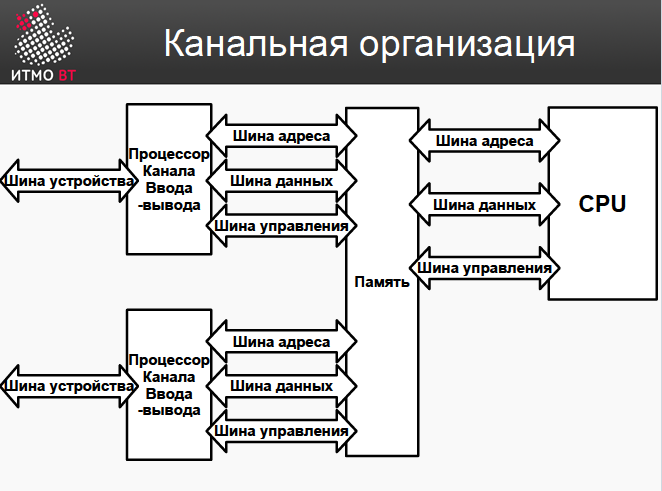
      - 双通道结构，两个内存通道并行操作的模式。消费者台式机和一些笔记本电脑最流行的模式。与单通道模式相比，您可以将吞吐量提高多达 2 倍。
    - 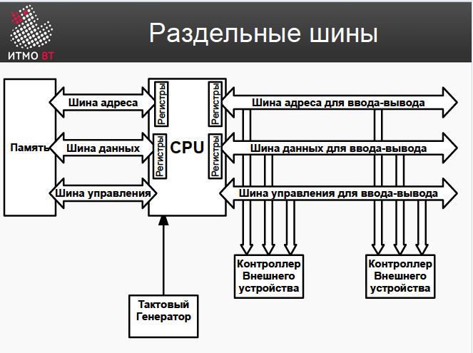
    - 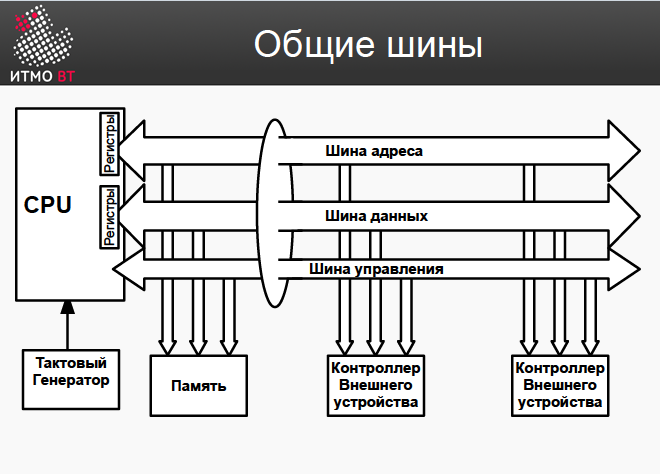
    - 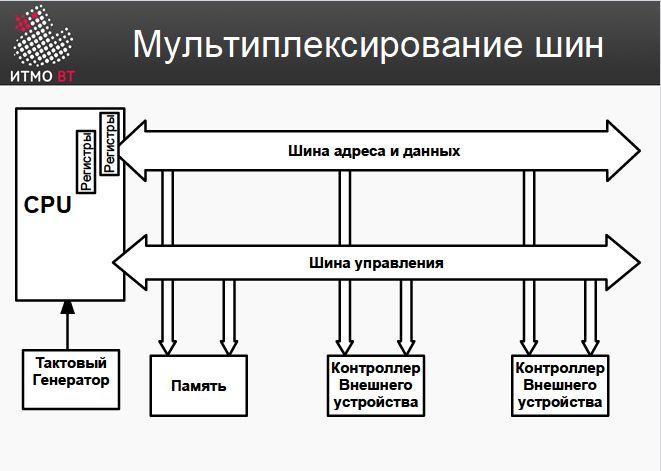
    - 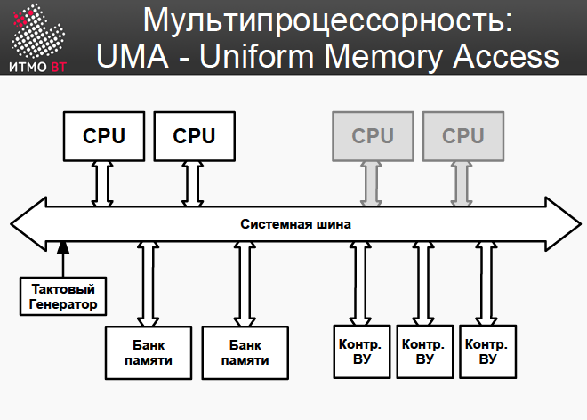
    - 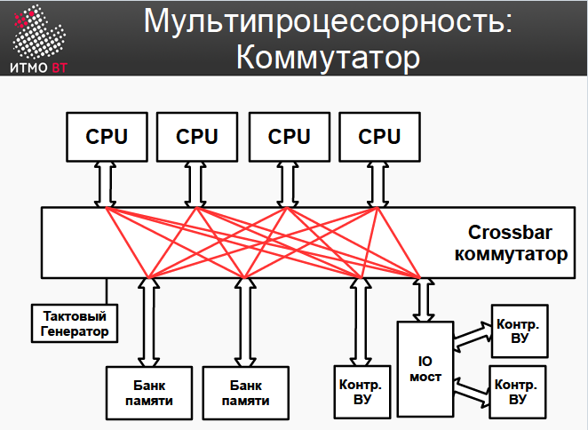
    - 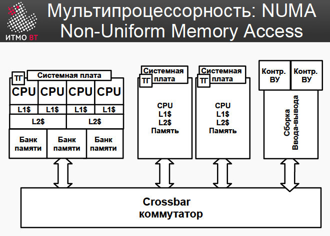
  - 现代计算机处理器
    - 地址和数据容量 16/32/64 位 
    - 时钟频率 500MHz-5GHz
    - 多处理器 1-100+ CPU
    - 多核 1-16 核
    - 从 1 GB 到 TB 的 RAM
    -  使用不同的缓存级别
    -  超标量（Суперскалярные）
    -  CISC、RISC、VLIW
  - 处理器类型
    - CISC（Complex Instruction Set Computer）复杂指令集计算机
      - 传统处理器（如英特尔）因兼容性而受到影响
    - RISC（Reduced Instruction Set Computer）精简指令集计算机
      - 简单指令集，每时钟指令执行
    - VLIW（Very Long Instructions Word）超长指令字
      - 将几条指令打包到一条指令中 – 将操作打包到一条指令中由编译器负责

## 存储设备

- 存储器
  - 概念：存储器是微机系统中必不可少的存储设备，主要用于存放程序（指令）和数据
  - 与寄存器的区别：寄存器位于 CPU 内，数量少，存取速度快，它主要用于临时存放参加运算的操作数和中间结果；而存储器一般在CPU外（但单片机CPU例外，其内部一般均含有一定容量的存储器），单独封装
  - 分级结构
  - 参数指标
    - 位置（Месторасположение）：位于处理器内，内部存储，外部存储
    - 容量（Емкость）：使用公制或二进制表示
    - 存储单元（Единица пересылки）：由数据总线的宽度决定的，即沿着总线并行传输的位数。对于内部存储器（RAM）存储单元一般为字（Слово）；而对于外部存储器，数据通常以大于字的单位传输，成为块（Blok）
    - 访问方法
      - 顺序访问（Последовательный доступ）：以固定顺序存取数据，因此
      - 直接访问（Прямой доступ）：允许设备直接读写存储器，而不需要中央处理器介入处理
      - 随机访问（Произвольный доступ）：可以在相等的时间内访问序列中任意元素或从所有可寻址元素中访问任何数据
      - 关联访问（Ассоциативный доступ）：其存储的数据可以通过数据本身的内容而不是通过地址或存储位置来标识以便访问
    - 时间与速率
      - 寻道时间/访问时间（Время доступа - Тд）：这是指把磁臂(磁头)移动到指定磁道上所经历的时间。该时间是启动磁臂的时间 s 与磁头移动 n 条磁道所花费的时间之和
      - 内存循环时间（Длительность цикла памяти - время обращения - Tц）
      - 读取和写入时间（Время чтения и время записи）
      - 返回时间（Время восстановления - Тв）
      - 信息传输速率
    - 物理类型与特性
    - 成本
- 静态与动态存储器
  - 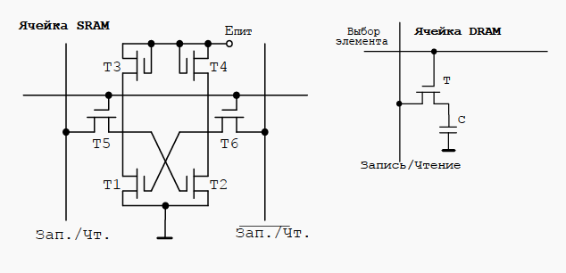
  - 静态存储器（Статическая）：工作速度快，只要电源不撤除，写入SRAM的信息就不会消失，不需要刷新电路，同时在读出时不破坏原来存放的信息，一经写入可多次读出，但集成度较低，功耗较大。SRAM一般用来作为计算机中的高速缓冲存储器(Cache)
  - 动态存储器（Динамическая）：利用场效应管的栅极对其衬底间的分布电容来保存信息，以存储电荷的多少，即电容端电压的高低来表示“1”和“0”。DRAM每个存储单元所需的场效应管较少，常见的有4管，3管和单管型DRAM。因此它的集成度较高，功耗也较低，但缺点是保存在DRAM中的信息__场效应管栅极分布电容里的信息随着电容器的漏电而会逐渐消失，一般信息保存时间为2ms左右。为了保存DRAM中的信息，必须每隔1～2ms对其刷新一次。因此，采用 DRAM的计算机必须配置动态刷新电路，防止信息丢失。DRAM一般用作计算机中的主存储器
- 可寻址存储器
  - 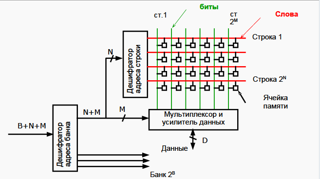
  - 概念：内容可寻址存储器cam（content-addressable memory）以内容进行寻址的存储器，是一种特殊的存储阵列ram。它的主要工作机制就是将一个输入数据项与存储在cam中的所有数据项自动同时进行比较，判别该输入数据项与cam中存储的数据项是否相匹配，并输出该数据项对应的匹配信息
  - 特性
    1. 160 ns的匹配时间
    2. 设有屏蔽寄存器
    3. 通过芯片级联扩展深度
    4. 时钟频率最高为50 mhz
    5. 匹配字宽和输出结果位宽可自定义
    6. 在atm模式下可进行vpc（virtual path circuits）和vcc（virtual connection circuits）的同时匹配
    7. 端口主要分为控制和匹配端口
    8. 20ons的插入时间（在12个输入数据项队列未满的情况下）
    9. 2ms的初始化时间（在设置了快速写入模式后）
    10. 具有符合ieee标准1149.1的测试端口（jtag）
  - 具有固定行和列的可寻址内存
    - 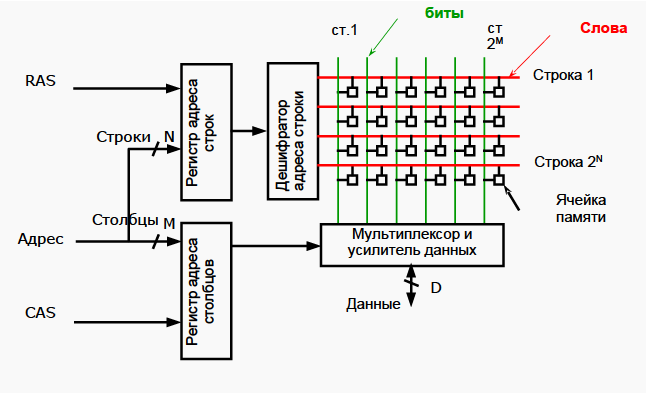
- 同步动态随机存取存储器SDRAM
  - 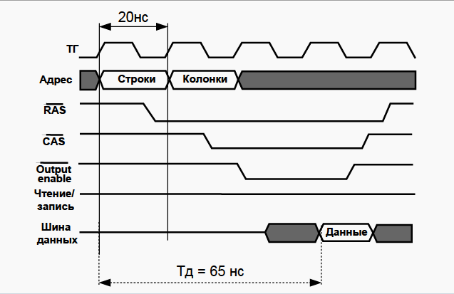
  - 概念：是动态随机存取存储器（DRAM），其接口与系统总线同步，该总线在CPU和内存控制器集线器之间传送数据。 SDRAM具有快速响应的同步接口，该接口与系统总线同步。 在响应控制输入之前，SDRAM等待时钟信号
- 现代内存的设计特点
  - Burst mode — пакетный режим 
  - Double Data Rate（DDR） — 在上升沿和下降沿均传输数据
  - SPD — 包含识别信息的芯片
  - Interleaving — 内存分层，提高性能
  - DDR4-2133 8192MB PC4-17000 性能指标
- 面向写入的存储器
- 串行存储器
  - 串行存取系统是指I/O设备与接口之间是一位一位地串行传送数据的存取系统或者是指客户端一次只能访问系统中一个节点。串行存取系统中需要的总线数目较少，数据传输距离较长，存取速度快。在通信中采取的传输方式就是串行；其次存储器支持串行读取
- 关联存储器设备的结构
  - 概念：关联存储器（相联存储器），是一种不根据地址而是根据存储内容来进行存取的存储器，可以实现快速地查找快表。既可以按照地址寻址也可以按照内容寻址（通常是某些字段），为了与传统寄存器作区别，称为按内容寻址的存储器
  - 原理：写入信息时按顺序写入，不需要地址；读出时，要求中央处理单元给出一个相联关键字，用它和存储器中所有单元中的一部分信息进行比较，若它们相等，则将此单元中余下的信息读出。这是实现存储器并行操作的一种有效途径，特别适合于信息的检索和更新
  - 结构：
    - 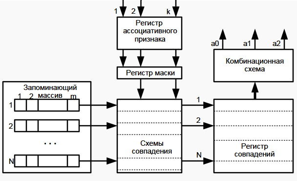
- 高速缓冲存储器
  - 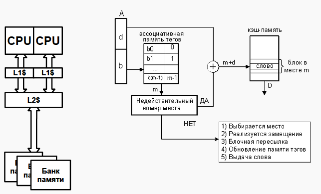
  - 概念：高速缓冲存储器是存在于主存与CPU之间的一级存储器， 由静态存储芯片(SRAM)组成，容量比较小但速度比主存高得多， 接近于CPU的速度。在计算机存储系统的层次结构中，是介于中央处理器和主存储器之间的高速小容量存储器。它和主存储器一起构成一级的存储器。高速缓冲存储器和主存储器之间信息的调度和传送是由硬件自动进行的
  - 组成结构：
    - Cache存储体：存放由主存调入的指令与数据块
    - 地址转换部件：建立目录表以实现主存地址到缓存地址的转换
    - 替换部件：在缓存已满时按一定策略进行数据块替换，并修改地址转换部件
  - 读取命中
    - 概念：CPU在Cache中找到有用的数据被称为命中，当Cache中没有CPU所需的数据时（这时称为未命中）
    - 缓存未命中的影响
      - 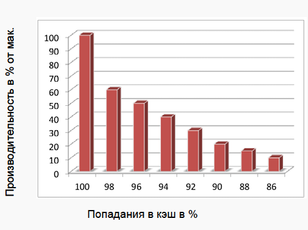
      - 由图可见，随着缓存命中率的下降，缓存的最大性能也随之下降
    - 为了保证CPU访问时有较高的命中率，Cache中的内容应该按一定的算法替换
      - “最近最少使用算法”（LRU算法），它是将最近一段时间内最少被访问过的行淘汰出局。因此需要为每行设置一个计数器，LRU算法是把命中行的计数器清零，其他各行计数器加1。当需要替换时淘汰行计数器计数值最大的数据行出局。这是一种高效、科学的算法，其计数器清零过程可以把一些频繁调用后再不需要的数据淘汰出Cache，提高Cache的利用率
      - 随机法（RAND法） 随机替换算法就是用随机数发生器产生一个要替换的块号，将该块替换出去，此算法简单、易于实现，而且它不考虑Cache块过去、现在及将来的使用情况，但是没有利用上层存储器使用的“历史信息”、没有根据访存的局部性原理，故不能提高Cache的命中率，命中率较低
      - 先进先出法（FIFO法） 先进先出（First-In-First-Out，FIFO）算法。就是将最先进入Cache的信息块替换出去。FIFO算法按调入Cache的先后决定淘汰的顺序，选择最早调入Cache的字块进行替换，它不需要记录各字块的使用情况，比较容易实现，系统开销小，其缺点是可能会把一些需要经常使用的程序块（如循环程序）也作为最早进入Cache的块替换掉，而且没有根据访存的局部性原理，故不能提高Cache的命中率。因为最早调入的信息可能以后还要用到，或者经常要用到，如循环程序。此法简单、方便，利用了主存的“历史信息”， 但并不能说最先进入的就不经常使用，其缺点是不能正确反映程序局部性原理，命中率不高，可能出现一种异常现象
- 存储器层级
    |容量|寻道时间/访问时间|*|类型|控制
    --|--|--|--|--|--
    CPU|100-1000б|<1нс|1c|寄存器Регистр|编译器компилятор
    L1 Cache|32-128Кб|1-4нс|2c|关联存储Ассоциативная|设备аппаратура
    L2-L3 Cache|0.5-32Мб|8-20нс|19c|关联存储Ассоциативная|设备аппаратура
    主存Основная память|0.5Гб- 4ТБ|60-200нс|50-300с|可寻址存储Адресная|程序программно
    SSD|128Гб- 1Тб/drive|25-250мкс|5д|块存储器Блочная|程序программно
    软盘Жесткие диски|0.5Тб- 4Тб/drive|5-20мс|4м|块存储器Блочная|程序программно
    磁带Магнитные ленты|1-6Тб/к|1-240c|200л|顺序存储Последовательная|程序программно
- 内存分配机制
  - 早期内存分配机制
    - 在早期的计算机中，要运行一个程序，会把这些程序全都装入内存，程序都是直接运行在内存上的，也就是说程序中访问的内存地址都是实际的物理内存地址。当计算机同时运行多个程序时，必须保证这些程序用到的内存总量要小于计算机实际物理内存的大小
    - 实例：某台计算机总的内存大小是128M，现在同时运行两个程序A和B，A需占用内存10M，B需占用内存110。计算机在给程序分配内存时会采取这样的方法：先将内存中的前10M分配给程序A，接着再从内存中剩余的118M中划分出110M分配给程序B。这种分配方法可以保证程序A和程序B都能运行，但是这种简单的内存分配策略问题很多：
    1. 进程地址空间不隔离。由于程序都是直接访问物理内存，所以恶意程序可以随意修改别的进程的内存数据，以达到破坏的目的。有些非恶意的，但是有bug的程序也可能不小心修改了其它程序的内存数据，就会导致其它程序的运行出现异常。这种情况对用户来说是无法容忍的，因为用户希望使用计算机的时候，其中一个任务失败了，至少不能影响其它的任务
    2. 内存使用效率低。在A和B都运行的情况下，如果用户又运行了程序C，而程序C需要20M大小的内存才能运行，而此时系统只剩下8M的空间可供使用，所以此时系统必须在已运行的程序中选择一个将该程序的数据暂时拷贝到硬盘上，释放出部分空间来供程序C使用，然后再将程序C的数据全部装入内存中运行。可以想象得到，在这个过程中，有大量的数据在装入装出，导致效率十分低下
    3. 程序运行的地址不确定。当内存中的剩余空间可以满足程序C的要求后，操作系统会在剩余空间中随机分配一段连续的20M大小的空间给程序C使用，因为是随机分配的，所以程序运行的地址是不确定的
  - 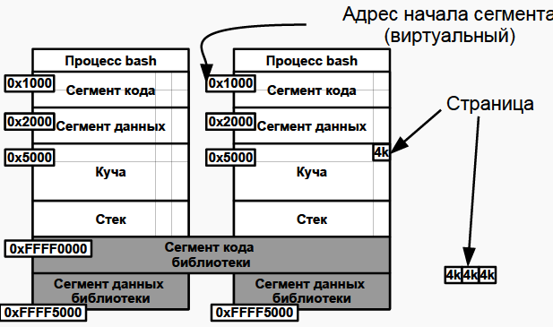 
  - 分段虚拟内存
   - 为了解决进程地址空间隔离的问题，我们增加一个中间层，利用一种间接的地址访问方法访问物理内存。按照这种方法，程序中访问的内存地址不再是实际的物理内存地址，而是一个虚拟地址，然后由操作系统将这个虚拟地址映射到适当的物理内存地址上。这样，只要操作系统处理好虚拟地址到物理内存地址的映射，就可以保证不同的程序最终访问的内存地址位于不同的区域，彼此没有重叠，就可以达到内存地址空间隔离的效果
  - 分页虚拟内存
    - 分页的基本方法是，将地址空间分成许多的页。每页的大小由CPU决定，然后由操作系统选择页的大小。在分段的方法中，每次程序运行时总是把程序全部装入内存，而分页的方法则有所不同。分页的思想是程序运行时用到哪页就为哪页分配内存，没用到的页暂时保留在硬盘上。当用到这些页时再在物理地址空间中为这些页分配内存，然后建立虚拟地址空间中的页和刚分配的物理内存页间的映射
  - MMU地址转换
    - 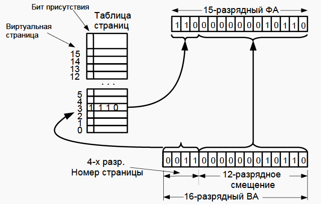
    - 把虚拟地址转化为物理地址
  - 转移后备缓冲器/页表缓存/转址旁路缓存 TLB（Translation Lookaside Buffer）
    - 概念为CPU的一种缓存，由内存管理单元用于改进虚拟地址到物理地址的转译速度
      - 特点缓存经常使用的转换
      - 通常地址和数据分开
      - 组织为关联存储器
    - TLB具有固定数目的空间槽，用于存放将虚拟地址映射至物理地址的标签页表条目。为典型的结合存储（content-addressable memory，首字母缩略字：CAM）。其搜索关键字为虚拟内存地址，其搜索结果为物理地址。如果请求的虚拟地址在TLB中存在，CAM 将给出一个非常快速的匹配结果，之后就可以使用得到的物理地址访问存储器。如果请求的虚拟地址不在 TLB 中，就会使用标签页表进行虚实地址转换，而标签页表的访问速度比TLB慢很多。有些系统允许标签页表被交换到次级存储器，那么虚实地址转换可能要花非常长的时间
    - TLB不命中：两种在现代体系结构中常用的解决 TLB 不命中的方案：
      - 硬件管理式 TLB ，CPU 自行遍历标签页表，查看是否存在包含指定的虚拟地址的有效标签页表条目。如果存在这样的分页表条目，就把此分页表条目存入 TLB ，并重新执行 TLB 访问，而此次访问肯定会寻中，程序可正常执行。如果 CPU 在标签页表中不能找到包含指定的虚拟地址有效条目，就会发生标签页错误异常，操作系统必须处理这个异常。处理标签页错误通常是把被请求的数据加载物理存储器中，并在标签页表中创建将出错的虚拟地址映射到正确的物理地址的相应条目，并重启程序（详见标签页错误）
      - 软件管理式 TLB，TLB 不命中时会产生“TLB 失误”异常，且操作系统遍历标签页表，以软件方式进行虚实地址转译。然后操作系统将分页表中响应的条目加载 TLB 中，然后从引起 TLB 失误的指令处重启程序。如同硬件式 TLB 管理，如果操作系统在标签页表中不能找到有效的虚实地址转译条目，就会发生标签页错误，操作系统必须进行相应的处理
      - 典型的TLB
        - 容量：12 - 4,096 分页表条目
        - 寻中时间：0.5 - 1 时脉周期
        - 不命中代价：10 - 30 时脉周期
        - 不命中率: 0.01% - 3%
        - 假如 TLB 寻中需要 1 个时脉周期，一次不命中访问需要 30 个时脉周期，而且不命中率是 1%，有效的存储器访问周期的平均值是 {\displaystyle 1\times 0.99+(1+30)\times 0.01=1.30}1\times 0.99+(1+30)\times 0.01=1.30 个时脉周期／每一存储器访问

## 网络技术
- 历史
  - 在山上点燃火 =)
  - 1792 - Клод Шапп - 光电报（оптический телеграф）信号量 - 每分钟 2 个字
  - 1872 - Жан Бодо - 电报机（телеграфный аппарат），Бодо 码。 Бод（比特每秒）
  - 1985.1897 - Попов - 岸上和军舰之间的无线传输
  - 1930 — 电传打字机（Телетайп）、电传网络（сеть Телекс）（TELEgraph + EXchange）
  - 1957 - 发射第一颗地球卫星
  - 1958 - 高级研究计划署 (Advanced Research Projects Agency - ARPA)
  - 1963 - J.C.R.Licklider - 计算机网络的第一个概念
  - 1969 - 美国领先实验室和研究中心的 ARPANET
  - 1976 - Xerox - 以太网局域网
  - 1982 - ARPA - TCP/IP 协议的单一堆栈
  - 1983 -84 - FidoNet 和 BBS，ARPANET → Internet
  - 1991 - Tim Berners-Lee，CERN，WWW 概念，第一个 http 服务器
- 计算机网络的概念
  - 计算设施（Средства вычислительной техники - СВТ）：计算机系统（вычислительные комплексы - ВК）和计算机系统（вычислительные системы - ВС）——实现数据处理
  - 通信设备（Средства телекоммуникаций (связи) - СТК）：一组通信信道和信道形成设备——实现数据传输
  - 计算机网络（Сеть ЭВМ (вычислительная сеть, компьютерная сеть）= СВТ + СТК
  - 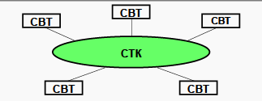
- 分类
  - 按覆盖范围分类
    - 个域网（PAN）：设备围绕一个人的通信。 比如说我的电脑，通过蓝牙和手机，耳机，手环等等相连，这就是个域网
    - 局域网（LAN）：局域网覆盖范围通常是一个屋子，一栋楼等等，这个大家比较熟悉，可以细分为有限局域网和无线局域网等
    - 城域网（WAN）：覆盖范围往往是一个城市。比较典型的是有线电视网。城域网通过接入点拉光纤等进入小区，在小区可以使用同轴电缆进入千家万户
    - 广域网（WAN）：它的覆盖范围很大，往往由核心城市组成一个大的网络，如下图所示。小的城市和大的城市相连，大的城市互相相连形成网络。覆盖中国的卫星网络就是一个广域网
  - 按目的分类
    - 计算类（Вычислительные）
    - 信息类（Информационные ）
    - 信息计算类（Информационно- вычислительные）
    - 信息管理类（Информационно- управляющие）
  - 按应用领域分类
    - SAN - 网络数据存储
    - 服务器网络（Серверные фермы）
  - 其他分类
    - 分层网络（Иерархические）
    - 无线网络（Беспроводные）
    - 虚拟网络（Виртуальные VLAN）
- 消息与数据包
  - 基本结构
  - 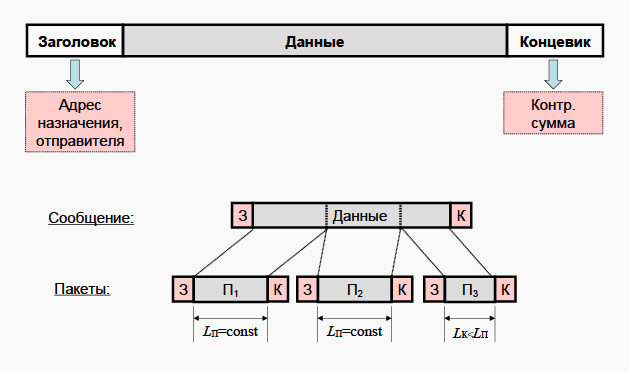
    |包头（Заголовок）|数据（Данные）|包尾控制信息|
    ---|---|--
    存储目标地址与发件人信息|内容|控制信息
  - 消息的结构遵循以上基本结构，但在传输的过程中，由于消息很长，所以将消息的数据部分按照恒定的宽度分成若干个包，包的数据部分取自消息的数据部分，并在前后加上消息的包头和包尾
- 开放式系统交互模型（Open System Interconnection Model - OSI）模型
  - 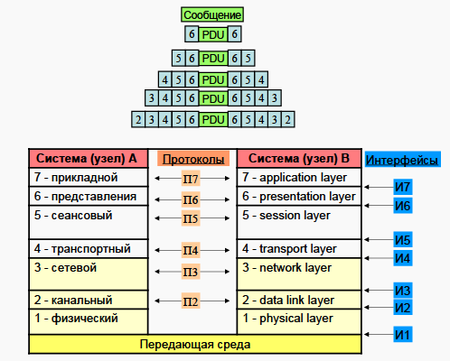
  - 概念：该模型将通信系统中的数据流划分为七个层，从分布式应用程序数据的最高层表示到跨通信介质传输数据的物理实现。每个中间层为其上一层提供功能，其自身功能则由其下一层提供。功能的类别通过标准的通信协议在软件中实现
  - 层次划分
    1. 物理层（Physical Layer）：物理层在局域网上发送数据帧（Data Frame），它负责管理电脑通信设备和网络媒体之间的互通。包括了针脚、电压、线缆规范、集线器、中继器、网卡、主机接口卡等
    2. 数据链路层（Data Link Layer）：数据链路层负责网络寻址、错误侦测和改错。当表头和表尾被加至数据包时，会形成信息框（Data Frame）。数据链表头（DLH）是包含了物理地址和错误侦测及改错的方法。数据链表尾（DLT）是一串指示数据包末端的字符串。例如以太网、无线局域网（Wi-Fi）和通用分组无线服务（GPRS）等。分为两个子层：逻辑链路控制（logical link control，LLC）子层和介质访问控制（Media access control，MAC）子层
    3. 网络层（Network Layer）：决定数据的路径选择和转寄，将网络表头（NH）加至数据包，以形成分组。网络表头包含了网络资料。例如:互联网协议（IP）等
    4. 传输层（Transport Layer）：把传输表头（TH）加至资料以形成分组。传输表头包含了所使用的协议等发送信息。例如:传输控制协议（TCP）等
    5. 会话层（Session Layer）：负责在数据传输中设置和维护计算机网络中两台计算机之间的通信连接
    6. 表示层（Presentation Layer）：把数据转换为能与接收者的系统格式兼容并适合传输的格式
    7. 应用层（Application Layer）：提供为应用软件而设计的接口，以设置与另一应用软件之间的通信。例如：HTTP、HTTPS、FTP、Telnet、SSH、SMTP、POP3等
- TCP/IP模型
  - 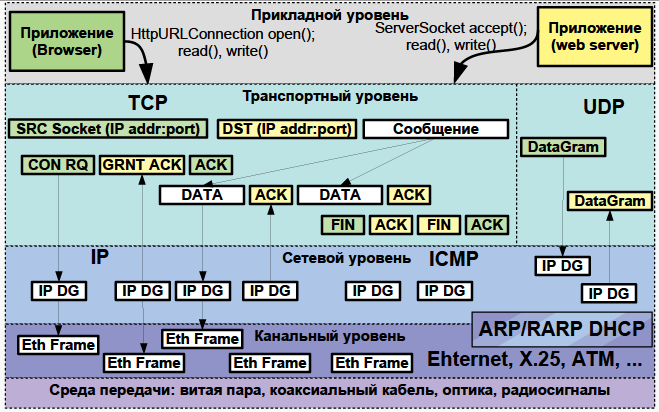
  - 概念：TCP/IP协议被称为传输控制协议/互联网协议，又称网络通讯协议(Transmission Control Protocol)。是由网络层的IP协议和传输层的TCP协议组成，是一个很大的协议集合。TCP/IP 模型由 OSI 模型演化而来
  - 层次划分：TCP/IP 模型将 OSI 模型由七层简化为五层（一开始为四层），应用层、表示层、会话层统一为应用层
    1. 物理层：计算机在传递数据的时候传递的都是0和1的数字，而物理层关心的是用什么信号来表示0和1，是否可以双向通信，最初的连接如何建立以及完成连接如何终止,总之，物理层是为数据传输提供可靠的环境
    2. 数据链路层：位于物理层和网络层之间，用来向网络层提供数据，就是把源计算机网络层传过来的信息传递给目标主机。数据链路层主要的作用包括：
      - 如何将数据组合成数据帧(Frame)，帧是数据链路层的传输单位
      - 数据链路的建立、维护和拆除
      - 帧包装、帧传输、帧同步
      - 帧的差错恢复
      - 流量控制
    3. 网络层：网络层位于传输层和数据链路层之间,用于把数据从源主机经过若干个中间节点传送到目标主机,并向传输层提供最基础的数据传输服务,它要提供路由（在能够选择的多条道路之间选择一条最短的路径）和选址（交换机是靠MAC来寻址的，而因为MAC地址是无层次的,所以要靠IP地址来确认计算机的位置,这就是选址）的工作
    4. 传输层：
      - 传输层是面向连接的、可靠的的进程到进程通信的协议。TCP提供全双工服务，即数据可在同一时间双向传播。TCP将若干个字节构成一个分组，此分组称为报文段(Segment)。提供了一种端到端的连接。
      - 传输层的协议主要有TCP 和 UDP，TCP(Transimision Control Protocal)是一种可靠的、面向连接的协议，传输效率低。UDP(User Datagram Protocal)是一种不可靠的、无连接的服务，传输效率高
    5. 应用层：应用层常见协议有HTTP、HTTPS 、FTP 、SMTP等
  - 发送方从高层到低层封装数据
    - 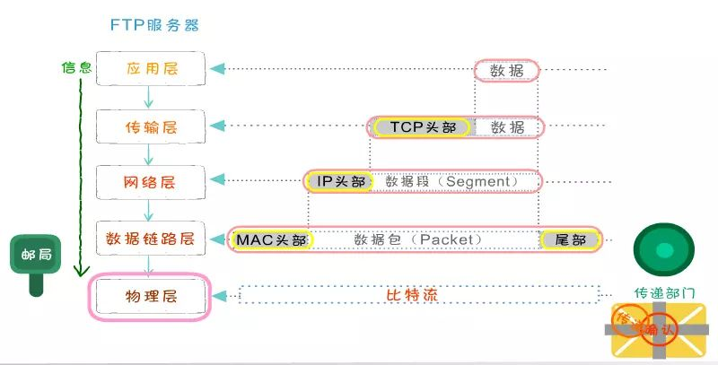
    - 在应用层要把各式各样的数据如字母、数字、汉字、图片等转换成二进制
    - 在TCP传输层中，上层的数据被分割成小的数据段，并为每个分段后的数据封装TCP报文头部
    - 在TCP头部有一个关键的字段信息端口号，它用于标识上层的协议或应用程序，确保上层数据的正常通信
    - 计算机可以多进程并发运行，例如在发邮件的同时也可以通过浏览器浏览网页，这两种应用通过端口号进行区分
    - 在网络层，上层数据被封装上亲的报文头部(IP头部)，上层的数据是包括TCP头部的。IP地址包括的最关键字段信息就是IP地址，用于标识网络的逻辑地址。
    - 数据链路径层，上层数据成一个MAC头部，内部有最关键的是MAC地址。MAC地址就是固化在硬件设备内部的全球唯一的物理地址。
    - 在物理层，无论在之前哪一层封装的报文头和还是上层数据都是由二进制组成的，物理将这些二进制数字比特流转换成电信号在网络中传输
  - 接收方从底层到高层解封装
  - 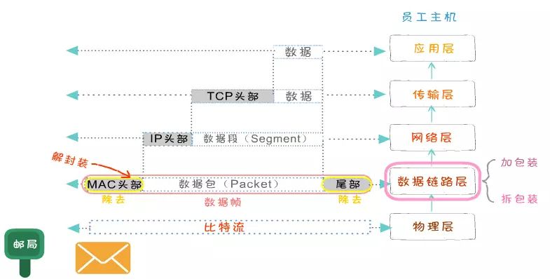
    - 数据封装完毕传输到接收方后，将数据要进行解封装
    - 在物理层，先把电信号转成二进制数据，并将数据传送至数据链路层
    - 在数据链路层，把MAC头部拆掉，并将剩余的数据传送至上一层
    - 在网络层，数据的IP头部被拆掉，并将剩余的数据送至上一层
    - 在传输层，把TCP头部拆掉，将真实的数据传送至应用层
- 传输介质
  - 同轴线缆（Коаксиальный кабель）- 已废弃
    - – “厚” - 10Base-5 - 最长 500m 
    - - “薄” - 10Base-2 - 最长 50m
  - 双绞线（Витая пара）
    - 10Base-T, 100Base-T, …
    - 3类：10 到 100 Mbps 100BASE-T4 (100m)
    - 5e 类：100Mbps（2 对），每（4 对）1Gbps
    - 6 类：10Gbps (55m)
    - 7a 类：40Gbps (50m)，100Gbps (15m)
  - 光学元件（10BASE-F,100BASE-SX,10GBASE-ER...）
    - ST（Straight Tip）
    - SC（Standard Connector）
    - LC（Lucent Connector） 
    - 激光器位于 SFP（Small Plugin Factor）
    - ~500 m (Multi-mode fiber），~80km（Single Mode）
  - 无线（802.11 - WiFi, 802.16 - WiMAX, 3G, 4G）
    - 2.4, 5, 60 GHZ
    - До 15 Гбит/c
- 以太网链路层
- IP网络层
  - IPv4网络寻址
    - IPv4使用分层寻址方案，一个32位的IP地址的划分如下
      - 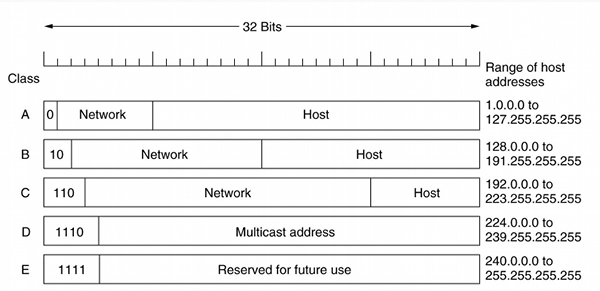
- 动态主机设置协议（Dynamic Host Configuration Protocol - DHCP）
  - 概念：是一个用于IP网络的网络协议，位于OSI模型的应用层，使用UDP协议工作
  - 用途：
    - 用于内部网或网络服务供应商自动分配IP地址给用户
    - 用于内部网管理员对所有电脑作中央管理
  - 原理：动态主机设置协议（DHCP）是一种使网络管理员能够集中管理和自动分配IP网络地址的通信协议。在IP网络中，每个连接Internet的设备都需要分配唯一的IP地址。DHCP使网络管理员能从中心结点监控和分配IP地址。当某台计算机移到网络中的其它位置时，能自动收到新的IP地址
- 域名服务
  - 域名：域名是Internet上某一台计算机或计算机组的名称，用于在数据传输时标识计算机的电子方位（有时也指地理位置）。域名是由一串用点分隔的名字组成的，通常包含组织名，而且始终包括两到三个字母的后缀，以指明组织的类型或该域所在的国家或地区
  - 概念：域名服务作为可以将域名和IP地址相互映射的一个分布式数据库，能够使人更方便的访问互联网，而不用去记住能够被机器直接读取的IP数串
  - DNS域名服务
    - DNS（Domain Name Server，域名服务器）是进行域名(domain name)和与之相对应的IP地址 (IP address)转换的服务器。DNS中保存了一张域名(domain name)和与之相对应的IP地址 (IP address)的表，以解析消息的域名
    - 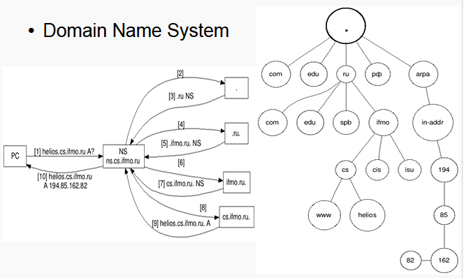
  - 其他域名服务
- 传输层
  - TCP - Transmission Control Protocol
    - 可靠，管理数据转发
    - 在两个系统上的套接字（Socket=IP:port）之间建立虚拟连接
    - HTTP、FTP、SSH、SMTP、...
  - UDP - User Datagramm Protocol
    - 发了条消息忘记了
    - 可靠性控制留给开发人员
    - 最大传输率
    - SNMP、TFTP、DHCP、DNS、...
- 应用层
  - 由程序员开发协议